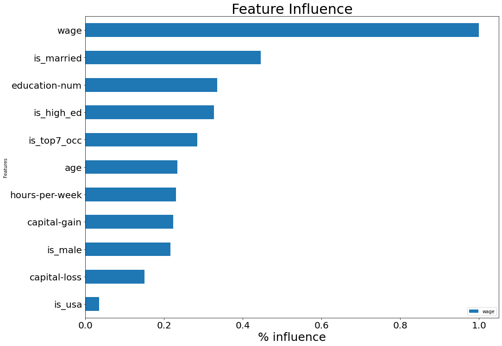
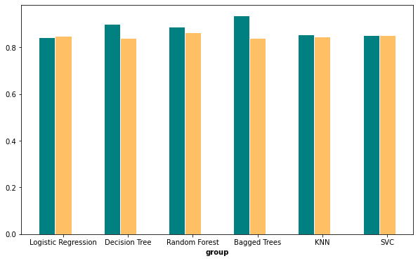

# Project 4
## Predicting wages
#### Jenny James, Lydia Kajeckas, Nikhil Lonberg,  & Tony Lucci

## Problem statement:
#### Our predatory lending fund is running out of vulnerable individuals to prey on. We need to determine which individuals would likely default on a payday loan. Using the 1994 census data, let’s build a model to identify individuals with an income of less than $50,000 a year.

#### To save time and money, we will make a simple model using no more than 10 features.

## Feature Engineering:
### We created several new features using the ones we had been given.

#### Higher education feature was anyone who had a vocational, Bachelors, Masters or Doctorate degrees

#### Is USA feature is anyone from the United States only

#### Top 7 occupations: Executive Manager, Professional Specialty, Protective Service, Tech Support, Sales, Craft Repair, Transport Moving

#### Binarized the sex feature

## Modeling:
#### We fit six models with grid searching, logistic regression, decision tree, random forest, bagged trees, KNN, and SVC. All of the models performed fairly well, with very low variance for logistic regression, random forest, KNN and SVC. This grouped bar chart shows the scoring for each model on the training and testing datasets, and we chose to use the random forest model with grid searching for our predictions.

## Proposal:
### Sensitivity: 63%
### Specificity:  94%
### Precision:    77%

#### Random Forest Algorithm generalizes to new data best. Our model predicts income class on testing data with 86% accuracy using only 10 features.  We want to maximize specificity because we are trying to reduce the number of false positives, and thus increase our chances of someone in the group predicted to make less than $50,000 a year actually falling within that income bracket.  

## PROJECT MAP
 - [README.md](./README.md)
 - [Code](./code)
  - [EDA](./code/01-eda.ipynb)
  - [Modeling](./code/02-modeling.ipynb)
  - ['Helper Functions](./code/helper_functions.ipynb)
 - [Presentation Deck](./Predicting_Wages_PresentationDeck.pdf)
 - [data](./data')
  - [Training Data](./data/large_train_sample.csv)
  - [Testing Data](./data/test_data.csv)
  - [Cleaned Training Data](./data/train_CLEAN.csv)
  - [Training Data Predictions](./data/test_predictions.csv)
 - [images](./images)
  - [Model Scores](./images/image.png)
  - [Feature Correlation Strengths](./images/top_variables.png)
  - [Confusion Matrix](./images/confusion_matrix.png)
  
  
## 05 Contact Information
- Tony M. Lucci (tonylucci@gmail.com)
- Lydia Kajeckas (lydiakajeckas@gmail.com)
- Jenny James (shinermaz@gmail.com)
- Nikhil Lonberg (nlonberg@gmail.com)
